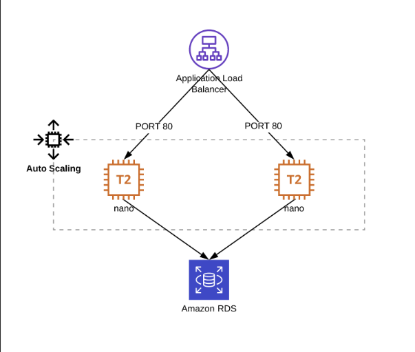

# Infrastructure deployment exercise

Using Terraform, automate the build of the following application in AWS. For the purposes of this challenge, use any Linux based AMI id for the two EC2 instances and simply show how they would be provisioned with the connection details for the RDS cluster.

There are a lot of additional resources to create even in this simple setup, you can use the code we have made available that will create some structure and deploy the networking environment to make it possible to plan/apply the full deployment. Feel free to use and/or modify as much or as little of it as you like.

Document any assumptions or additions you make in the README for the code repository. You may also want to consider and make some notes on:

How would a future application obtain the load balancer’s DNS name if it wanted to use this service?

What aspects need to be considered to make the code work in a CD pipeline (how does it successfully and safely get into production)?

## Solution

- **Question 1:** Although the ALB already provides a DNS domain, it is not user friendly. In order to make it easier for users to consume our service we should create a new alias record in Route53 pointing to the ALB, using a more user friendly name. If the service needs to be consumed from the Internet, we should own the domain we want to use, and we should also configure a DNS delegation from the domain name provider DNS servers, into our Route53 Hosted Zone.
- **Question 2:** In a Continuous Deployment pipeline we need to make sure the changes we push are properly tested before are deployed, and even once deployed, there should be some health probes (to verify the systems are healthy) and some smoke tests (to verify no app functionality is broken) to verify everything works as expected and have an automatic rollback system to revert the changes if the deployment didn't go as expected.

### Assumptions

- Since the current ALB version doesn't have TLS configuration in place, a "expose_to_internet" have been added to configure the ALB to be internal and allow only access from within its Security Group, until a more secure implementation is in place.
- Due to the lack of context about where this Terraform code will be used, no modules have been implemented for the sake of simplicity over reutilization.
- In order for the EC2 instances to have the connection details to connect to the RDS database, these could be stored in SecretsManager and then retrieved from the EC2 scripts. This will require additional resources IAM permissions to be created.

### Additional notes

#### Improvements

- Update the AWS provider
- Move common tags to provider
- Update EIP definition to match the current provider version
- Add comments and order the network resources to group them logically (private vs. public subnets)

#### Things to improve

- Improve "allow_lb_write_logs" S3 bucket policy to allow only write permissions from ALBs in the same account.
- Create a certificate with AWS ACM and expose the app to the Internet using port 443 with TLS.
- Remote S3 backend should be implemented in order to store the tfsate remotely and prevent any misalignment between deployments and to enable the code to be run from a CI/CD pipeline.
